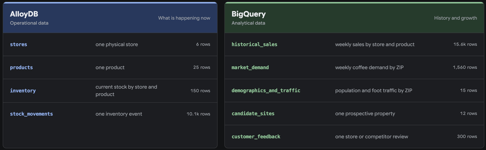

# SVL workshop attendee guide

You need:

- Your assigned Google Cloud project ID
- Google Cloud CLI and Node.js
- Codex CLI, Claude Code CLI, or both

## Set up

Sign in if needed:

```bash
gcloud auth login
gcloud auth application-default login
```

### 1. Clone the repository

```bash
git clone https://github.com/jeffonelson/svl-data-workshop.git
cd svl-data-workshop
```

### 2. Configure and verify

Replace the placeholder below, including the angle brackets, with your assigned
Google Cloud project ID.

`./bin/setup` checks access to your assigned project and secrets, then installs
and configures the Data Agent Kit plugin for each supported agent on your computer.

```bash
./bin/setup <INSERT_YOUR_GOOGLE_CLOUD_PROJECT_ID>
```

Before running doctor, sign in to your chosen CLI if needed: `codex login` or `claude auth login`.

`./bin/doctor` runs read-only checks for the required software, agent CLI login,
Google Cloud authentication, plugin installation, and MCP configuration.

```bash
./bin/doctor
```

### 3. Launch one agent

Use a workshop launcher instead of running `codex` or `claude` directly so it
can load the workshop credentials and project settings before starting the agent.

```bash
./bin/workshop-codex
```

```bash
./bin/workshop-claude
```

Trust the repository when prompted. Keep this session open for the entire lab.

## Connectivity check

First, run `/mcp` in the agent and confirm that the Developer Knowledge, Maps
Grounding Lite, Cloud Run, BigQuery, and AlloyDB MCP servers are loaded.

Then paste the following prompt into the same agent session and run it:

```text
Use the MCP tools for these checks. Make one successful read-only call to each service:

1. Developer Knowledge: retrieve the official BigQuery row-level security documentation.
2. Maps: find two coffee shops near Golden Gate Park and include their Google Maps links.
3. BigQuery: list datasets in the workshop project.
4. AlloyDB: list clusters in us-central1.

Return a four-row PASS/FAIL table. Empty BigQuery or AlloyDB results count as PASS.
```

## Data landscape

[](https://jeffonelson.github.io/svl-data-workshop/data-landscape.html)

[Open the interactive data landscape](https://jeffonelson.github.io/svl-data-workshop/data-landscape.html)
to explore the tables, their grain, and the relationships between them.

## Charlie's expansion scenario

Charlie's Coffee operates six San Francisco stores and is choosing where to open
next. Run the featured prompts for the shortest path through the scenario, then
choose any optional follow-ups that match your interests and available time.
Continue in the same agent session so later prompts can build on earlier findings.

### Frame the decision

#### Featured prompt

```text
According to the official Google Cloud documentation, why might AlloyDB be a
better home for live inventory than BigQuery, and when would that choice stop
making sense?
```

#### Optional follow-ups

```text
How can we analyze AlloyDB and BigQuery together without first building another ETL pipeline? Use the official Google Cloud documentation and cite the documents you use.
```

```text
Charlie's wants to open a seventh San Francisco store. Help me make a recommendation we can defend. Before running any analysis, what evidence would you want, and where would you expect to find it?
```

### Investigate unmet demand

#### Featured prompt

```text
Where is Charlie's inventory failing to meet customer demand?
```

#### Optional follow-ups

```text
Can stock-movement history explain how those shortages developed?
```

### Check the customer evidence

#### Featured prompt

```text
Use BigQuery AI to extract availability complaints from customer reviews.
Do they corroborate the live inventory?
```

#### Optional follow-ups

```text
Can you combine the operational and analytical evidence in one analysis without copying the AlloyDB data into BigQuery first?
```

```text
Which complaints match specific store/product pairs, and which are ambiguous?
```

### Choose a new location

#### Featured prompt

```text
Use BigQuery AI.FORECAST to forecast six months of candidate-market demand.
Which site looks best after estimating store revenue and accounting for rent?
```

#### Optional follow-ups

```text
What separates Charlie's strongest store markets from its weakest ones?
```

```text
How did you translate market demand into store revenue? Check your assumptions
against Charlie's existing stores.
```

```text
What assumptions have the most influence on the ranking, and what would need to change for the runner-up to win?
```

### Make it local (optional)

Want to explore somewhere you know? Bring Charlie's to your own spot. Replace
`[LOCATION]` with anywhere in the world you'd like to explore; include the country
if the name could be ambiguous. San Francisco's numbers remain business benchmarks.
Skip this section to continue with your San Francisco recommendation.

#### Featured prompt

```text
What if Charlie's expanded into [LOCATION]? Use Maps to suggest three areas
worth exploring, informed by what we learned from its San Francisco stores.
```

#### Follow-up

```text
Which area looks most promising, and what would we need to verify?
Pick a specific map anchor for a hypothetical store to explore next.
```

### Test the recommendation in the real world

#### Featured prompt

```text
Use Maps to stress-test your recommended SF expansion spot. What nearby evidence
strengthens or weakens the case? Include the Google Maps source link
immediately after every place-based claim.
```

#### Optional follow-ups

```text
Does nearby coffee competition indicate saturation, or does it validate demand?
```

```text
Use Maps to find nearby residential areas and check their driving times from the site.
```

```text
Which nearby residential buildings and neighborhood anchors are within a 10-minute walk of the site and could contribute launch-day foot traffic?
```

### Plan the launch

#### Featured prompt

```text
Design a launch-week plan for the recommended site using everything we have learned.
```

#### Optional follow-ups

```text
If we held an outdoor launch event at the recommended site this weekend, what do the hourly and daily weather forecasts suggest, and how should we adjust the plan?
```

```text
Which nearby gyms and coworking spaces should we approach as launch partners?
```

```text
What stock problems should we avoid repeating at launch?
```

```text
Revise the launch plan based on what you discovered.
```

### Visualize and share (optional)

#### Featured prompt

```text
Build an interactive BI dashboard that helps our team explore Charlie's sales,
inventory, and market demand. Highlight the most interesting findings.
```

#### Optional follow-ups

```text
Audit the dashboard's numbers and labels against the source data.
```

```text
Deploy the dashboard to Cloud Run so our team can revisit it. Return the live URL.
```


## Uninstall

Exit the agent, then run:

```bash
./bin/teardown
```

This removes workshop-installed agent plugins and local workshop state. It does
not change Google Cloud or delete this repository.

## Disclaimer

This is a project intended for demonstration and workshop purposes only. It is
not intended for use in a production environment. This repository is not an
officially supported Google product.
